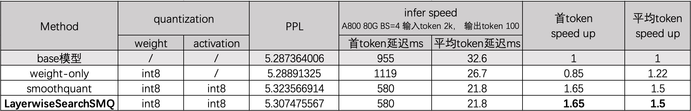

<div align="center">
<h1>LayerwiseSearchSMQ</h1>
<h3>一种自动化量化大模型的压缩算法<h3>
</div>

## Introduction
> 基于现有SmoothQuant量化算法改进，在保证加速比的前提下提高量化后精度。
> *[SmoothQuant: Accurate and Efficient
Post-Training Quantization for Large Language Models](https://arxiv.org/abs/2312.11983)* [[arXiv]](https://arxiv.org/pdf/2211.10438.pdf)

#### Why LayerwiseSearchSMQ:
- [x] **No training required**: PTQ压缩,减少压缩成本。
- [x] **Efficient compression**: 自动化调参。
- [x] **Better performance**: 和SOTA量化方案相比，本方案能获取更高加速比和精度。

#### Supported LLMs:
- [x] Llama
- [x] Qwen
- [x] Baichuan

## Table of Contents
  - [Quick Start](#quick-start)
  - [Configuration Instruction](#configuration-instruction)
  - [Language Modeling Evaluation](#language-modeling-evaluation)

## Quick Start
### Installation
安装TILearn.llm包(最新)
```
pip install tilearn-llm
```

### Demo
```
sh run.sh
```
此脚本是执行全流程，包括模型校准搜索scale，量化，评测指标及保存量化后模型。
    
## Configuration Instruction
### Searching

**根据指定校准数据统计原模型输入输出scale，并且layerwise搜索出不同module的最佳smooth_alpha:**
```
python calc_module_scales.py \
    --model_name_or_path /mnt/data/tilearn/pretrain_models/Baichuan2-13B-Base/ \
    --save_path /mnt/data/tilearn/pretrain_models/LayerwiseSearchSMQ_Baichuan2-13B-Base/ \
    --calib_data /mnt/data/huecheng/datasets/wikitext
```
Arguments:
- `--model_name_or_path`: 支持AutoModelForCausalLM.from_pretrained方式加载的模型
- `--save_path`: 保存量化中间结果
- `--calib_data`: 校准数据，统计模型activation scales

### Quantizing

**根据searching出的最优超参量化module，并保存量化后模型，给出量化测试结果。**
```
python quant_module.py \
    --model_name_or_path /mnt/data/tilearn/pretrain_models/Baichuan2-13B-Base/ \
    --save_path /mnt/data/tilearn/pretrain_models/LayerwiseSearchSMQ_Baichuan2-13B-Base/ \
    --test_data /mnt/data/huecheng/datasets/wikitext
```
Arguments:
- `--model_name_or_path`: 支持AutoModelForCausalLM.from_pretrained方式加载的模型
- `--save_path`: 加载量化中间结果及保存量化后模型参数
- `--test_data`: 测试数据

## Language Modeling Evaluation   
Baichuan2 13B模型在wikitext2 test数据集上测试结果
<p align="center">
 <br>
</p>